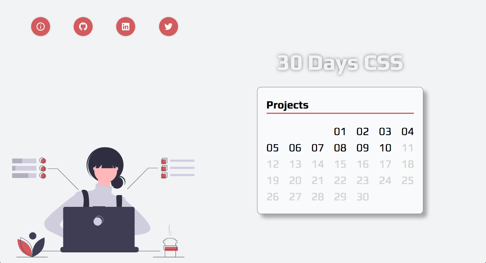

# Challenge #30daysCSS 

## Objectives 🎯
This challenge consists in developing one mini-project a day for 30 days, to improve coding skills using CSS3 and HTML5

## Rules ⚠️
- Every day a project must be completed until 23:59pm
- If a project isn't completed, it will accumulate for the following day

## Projects 💻

- You can see the whole project by clicking the image bellow

|Day|Project/code|
|:--:|:--:|
|01|[Beating Heart](https://github.com/driellyps/30daysCSS/tree/master/projects/day01)|
|02|[Flipping Text](https://github.com/driellyps/30daysCSS/tree/master/projects/day02)|
|03|[Search Input](https://github.com/driellyps/30daysCSS/tree/master/projects/day03)|
|04|[Dessert Cards](https://github.com/driellyps/30daysCSS/tree/master/projects/day04)|
|05|[Loading animation](https://github.com/driellyps/30daysCSS/tree/master/projects/day05)|
|06|[Slider with radio buttons](https://github.com/driellyps/30daysCSS/tree/master/projects/day06)|
|07|[Hover button](https://github.com/driellyps/30daysCSS/tree/master/projects/day07)|
|08|[Dark Mode Switch](https://github.com/driellyps/30daysCSS/tree/master/projects/day08)|
|09|[Social Media Icons](https://github.com/driellyps/30daysCSS/tree/master/projects/day09)|
|10|[Coffee loader](https://github.com/driellyps/30daysCSS/tree/master/projects/day10)|
|11|[Business card](https://github.com/driellyps/30daysCSS/tree/master/projects/day11)|
|12||
|13||
|14||
|15||
|16||
|17||
|18||
|19||
|20||
|21||
|22||
|23||
|24||
|25||
|26||
|27||
|28||
|29||
|30||

## License
This project is under MIT License
